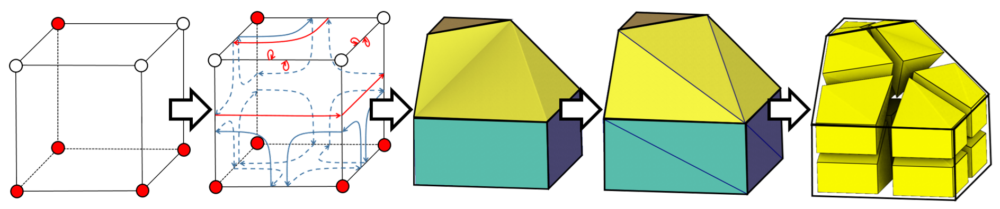

I am currently working on an algorithm that can extract hexaedra from a domain. The aim of this project is to be able to extract hexes from non-integer paremetrization. This would greatly increase robustness in current parametrization method that struggle a lot on general domains. For more info you can see my [talk on the project](/talks/frames2020). The code is available on [github](https://github.com/fprotais/marchinghex), please check it out, it is easy to run. This is a work in progress, and progress is coming soon we think. 

Result obtained with our code:

