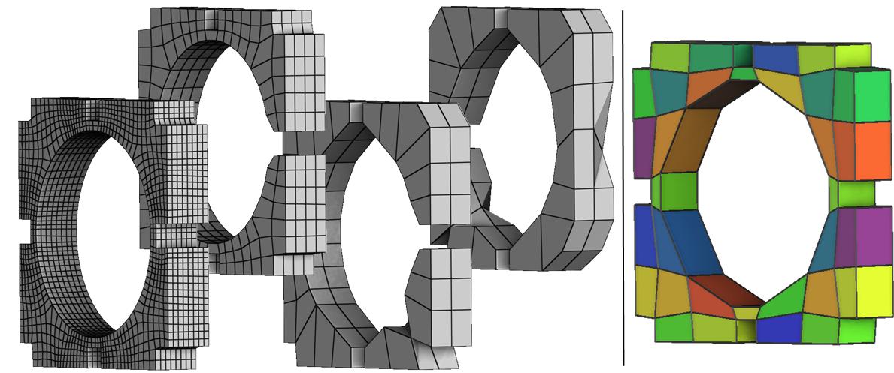

I presented the debut of my work on Polycube bijectivity at [Frame 2019](https://www.hextreme.eu/frames2019/), a workshop on frame-based Hexaedral meshing organised by the Hextreme team from UCLouvain. Slides of my talk are available on the workshop page. Pre-print to appears soon. 

