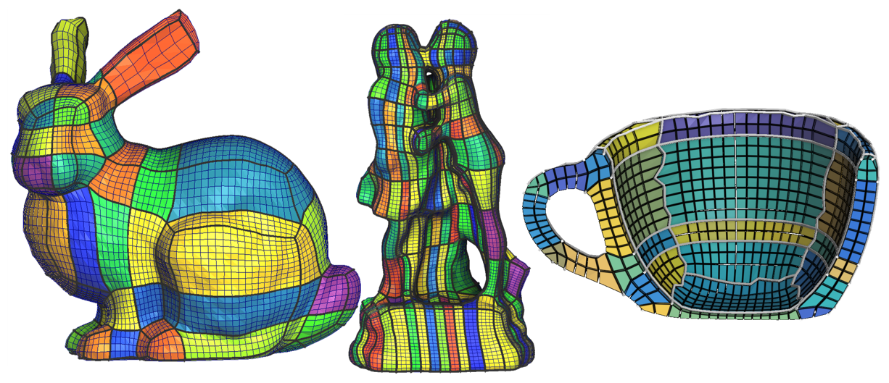

**This talk won the price of the best presentation at the event.**

I presented my advancement on the usage of Polycubes to produce hexaedral meshes. As the conference was organisated by the [french geometry modeling work group (GMTG)](https://gtmg2020.sciencesconf.org/), the presentation was done in french ([link to the video](https://www.youtube.com/watch?v=Xtegca1n6qE)). Pre-print of this works will soon be available in english. 

