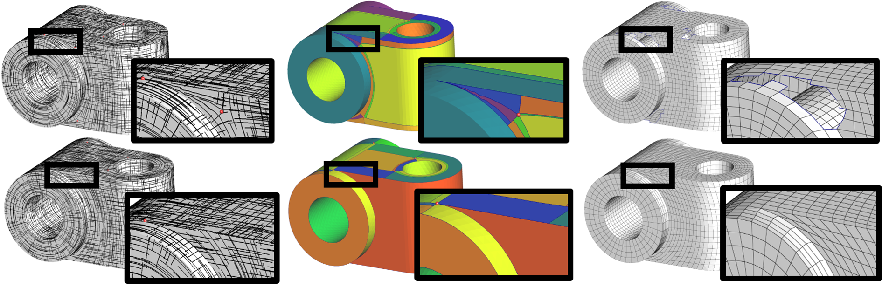

I presented a work that enable a better treatment on sharp features present in CAD models, when generating quadmeshes. As the conference was organisated by [the french association of computer graphics (AFIG)](https://jfig2020.sciencesconf.org/), the presentation was done in french ([link to the video](https://www.youtube.com/watch?v=Z744x2_bnVY&t=712s)). You can find a proceeding in french in [Publications](/publication/jfig2020).
