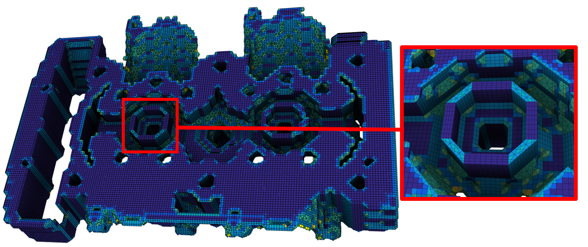

I presented a current project of my team, marchinghex (see [project page](/projects/marchinghex)) at [Frame 2020](https://www.hextreme.eu/frames2020/), a workshop about Hexaedral meshing organised  by the Computer Graphics Group from University of Bern, the Pixel team from INRIA/Loria and the Hextreme team from UCLouvain. You can find a video of the talk [here](https://www.youtube.com/watch?v=6igfpWlXhBA) (in english).

Result obtained with our code:

